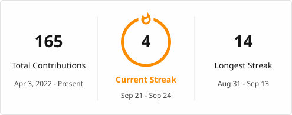

# 👋 Hi, I'm Shivam Kumar

### Full-Stack Developer | React | Next.js | Node.js | MongoDB

I build full-stack web applications, responsive interfaces, REST APIs, authentication systems, dashboards, and data-driven applications.

🎓 B.Tech — Computer Science & Engineering  
📍 Dehradun, Uttarakhand, India

  
  
  

---

## 🔥 GitHub Contribution Streak

  

> This streak card is generated automatically from my GitHub contribution calendar by GitHub Actions.

---

## 📊 GitHub Activity

  
  

  

> GitHub's own profile page remains the source of truth for the contribution graph. The statistics, language, and streak cards above are generated and stored in this repository by GitHub Actions.

---

## 🧰 Technologies I Work With

### Frontend
- React
- Next.js
- JavaScript
- TypeScript
- HTML5
- CSS3
- Tailwind CSS
- Vite

### Backend
- Node.js
- Express.js
- FastAPI
- REST APIs
- JWT authentication

### Databases & Services
- MongoDB
- MongoDB / Mongoose
- MySQL
- Supabase
- PostgreSQL
- Supabase Authentication
- Supabase Realtime

### Tools & Libraries
- Git
- GitHub
- Framer Motion
- Axios
- TanStack Query
- Chart.js
- Tesseract.js
- PDFKit

---

## ⭐ Featured Projects

### 🛡️ CertiVerify — Certificate Verification Platform

**React · Vite · Node.js · Express · MongoDB · JWT · Tesseract.js**

A certificate verification system supporting certificate issuance, public verification, OCR-assisted image verification, student/admin portals, PDF generation, and verification analytics.

**[View Repository →](https://github.com/shivamsharmakr04/Certificate-verification-system)**

---

### 🎓 Student Dashboard

**Next.js · React · TypeScript · Express · Supabase · Tailwind CSS**

A full-stack student management dashboard with authentication, course progress, assignments, schedules, academic analytics, profile management, Supabase Realtime synchronization, REST APIs, and Row Level Security.

**[View Repository →](https://github.com/shivamsharmakr04/Student-Dashboard)**

---

### 💰 Finova Pro — Personal Finance Dashboard

**Node.js · Express · JavaScript · Chart.js · JWT**

Personal finance platform with transactions, budgets, savings goals, subscriptions, analytics, exports, multi-currency support, background synchronization, and forecasting features.

**[View Repository →](https://github.com/shivamsharmakr04/finance-Dashboard)**

---

### 💼 Job Listing Platform

**React · Vite · Node.js · Express · MongoDB · JWT**

Full-stack job portal with candidate/admin authentication, job search, job management, applications, profiles, dashboards, and resume uploads.

**[View Repository →](https://github.com/shivamsharmakr04/job-listing-app)**

---

### ✈️ Flight Booker

**React · Vite · Node.js · Express · Tailwind CSS · JWT**

Flight reservation application with flight search, seat selection, passenger management, checkout workflow, booking history, digital boarding passes, and PDF ticket generation.

**[View Repository →](https://github.com/shivamsharmakr04/flight-booker)**

---

### 🛰️ IBVAP — Intelligent Border Video Analytics Platform

**React · Vite · FastAPI · PostgreSQL · SQLite · WebSockets**

Full-stack command-and-control prototype for camera monitoring, zones, events, alerts, watchlists, dashboard data, media handling, and real-time alert delivery.

**[View Repository →](https://github.com/shivamsharmakr04/IBVAP)**

---

### ⚛️ Elementum — AI & Digital Product Studio

**React 19 · Vite · Tailwind CSS · Framer Motion**

Interactive frontend project featuring a product-studio landing page, portfolio exploration, services, project estimator, inquiry wizard, testimonials, FAQs, responsive navigation, and motion-driven UI.

**[View Repository →](https://github.com/shivamsharmakr04/Elementum)**

---

### 🎨 Personal Portfolio

**HTML5 · CSS3 · JavaScript · Canvas API**

Personal developer portfolio with multi-theme UI, particle background, 3D card interactions, developer-style terminal interface, project filtering, contact form integration, and responsive design.

**[View Repository →](https://github.com/shivamsharmakr04/Personal-Portfolio)**

---

## 📚 Learning & Development

- Advanced JavaScript and TypeScript
- React and Next.js
- Backend architecture and REST API development
- Data Structures & Algorithms
- AI-powered web applications

---

## 💼 Experience

**Frontend Development Intern — Happieloop Technologies**  
_Remote · 2025_

Frontend development focused on responsive interfaces and modern web development workflows.

**Full-Stack / AI Engineering Intern — Techsolv IT Service**  
_Remote_

Experience across AI concepts, data structures, backend development, frontend development, and model-oriented problem solving.

---

## 📌 Other Repositories

- **Frontend Interview** — React + TypeScript blog application using TanStack Query, Tailwind CSS, JSON Server, Framer Motion, and reusable components.
- **Thirdeye** — Private repository.
- Additional projects and experiments are available on my GitHub profile.

---

## 🤝 Connect

  <a href="mailto:shivamsharmakr04@gmail.com">Email</a> •
  <a href="https://linkedin.com/in/shivam-kumar-b0aab2209">LinkedIn</a> •
  <a href="https://github.com/shivamsharmakr04">GitHub</a> •
  <a href="https://github.com/shivamsharmakr04/Personal-Portfolio">Portfolio</a>

---

  <b>Build · Learn · Improve · Ship</b>

