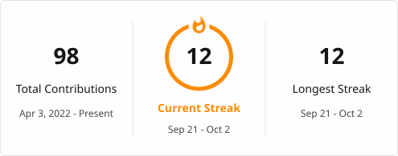

# 👋 Hi, I'm Shivam Kumar

  
  
  

  
  
  

  
  

---

## 🎯 Recruiter Snapshot

I'm a **Full-Stack Developer with a strong frontend focus**, specializing in building fast, modern, and user-friendly web applications using **React**, **Next.js**, and **TypeScript**. I excel at creating polished interfaces, optimizing performance, and building scalable backend systems that power product experiences.

  
  
  
  

---

## 💪 Why Hire Me

| Skill | Proven By |
|---|---|
| **Frontend Mastery** | 6 production projects with React/Next.js, responsive design, motion, and performance optimization |
| **Full-Stack Capability** | End-to-end development: APIs, authentication, database design, and real-time features |
| **React & Modern JS** | Advanced TypeScript, hooks, state management, and component architecture patterns |
| **User-Focused Design** | Built dashboards, platforms, and tools that prioritize usability and visual polish |
| **Scalable Architecture** | Experience with RESTful APIs, authentication (JWT), and optimized database queries |
| **Product Thinking** | I don't just code features—I understand why they matter and how they drive value |

---

## 🛠️ Tech Stack Specialization

### **Frontend** (Strong Expertise)

  

**Skills:** React Hooks • Next.js (App & Pages Router) • TypeScript • Tailwind CSS • Responsive Design • Performance Optimization • Framer Motion • State Management • Modern Component Patterns

### **Backend** (Full Capability)

  

**Skills:** Node.js & Express • FastAPI • REST APIs • JWT Authentication • Database Design • SQL & NoSQL • Supabase & PostgreSQL • Real-time Features • WebSockets

### **Tools & Workflow**

  

---

## 🌟 Featured Projects (Full-Stack & Frontend Focus)

<table>
  <tr>
    <td width="50%" valign="top">
      <h3>🎓 Student Dashboard</h3>
      <b>Full-Stack Academic Platform</b>
        
      <strong>Tech:</strong> Next.js • React • TypeScript • Express • Supabase • Tailwind CSS
        
      <strong>What I Built:</strong>
      - Complete authentication & authorization system
      - Interactive course dashboard with real-time data sync
      - Assignment management with analytics
      - TypeScript-driven type-safe API layer
      - Row-level security (RLS) for data protection
        
      <a href="https://github.com/shivamsharmakr04/Student-Dashboard"><strong>View Project →</strong></a>
    </td>
    <td width="50%" valign="top">
      <h3>⚛️ Elementum</h3>
      <b>Modern Product Landing Page</b>
        
      <strong>Tech:</strong> React 19 • Vite • Tailwind CSS • Framer Motion
        
      <strong>What I Built:</strong>
      - High-performance landing page with optimized bundle
      - Smooth animations & interactive sections
      - Responsive design across all devices
      - Lead generation forms & CTAs
      - Accessibility & SEO best practices
        
      <a href="https://github.com/shivamsharmakr04/Elementum"><strong>View Project →</strong></a>
    </td>
  </tr>
  
  <tr>
    <td width="50%" valign="top">
      <h3>✈️ Flight Booker</h3>
      <b>Full-Stack Booking Platform</b>
        
      <strong>Tech:</strong> React • Vite • Node.js • Express • Tailwind CSS • JWT
        
      <strong>What I Built:</strong>
      - End-to-end booking journey (search → payment → confirmation)
      - Real-time seat selection UI
      - Passenger management forms
      - PDF ticket generation
      - JWT-based auth & session management
        
      <a href="https://github.com/shivamsharmakr04/flight-booker"><strong>View Project →</strong></a>
    </td>
    <td width="50%" valign="top">
      <h3>💰 Finova Pro</h3>
      <b>Personal Finance Dashboard</b>
        
      <strong>Tech:</strong> Node.js • Express • JavaScript • Chart.js • JWT
        
      <strong>What I Built:</strong>
      - Interactive finance dashboard with charts
      - Budget tracking & savings goals
      - Transaction analytics & forecasting
      - Data visualization for insights
      - Multi-currency support
        
      <a href="https://github.com/shivamsharmakr04/finance-Dashboard"><strong>View Project →</strong></a>
    </td>
  </tr>

  <tr>
    <td width="50%" valign="top">
      <h3>🛡️ CertiVerify</h3>
      <b>Certificate Verification Platform</b>
        
      <strong>Tech:</strong> React • Vite • Node.js • Express • MongoDB • Tesseract.js
        
      <strong>What I Built:</strong>
      - Admin & student portal interfaces
      - OCR-powered image verification
      - Secure certificate issuance workflow
      - PDF generation & verification analytics
      - Role-based access control
        
      <a href="https://github.com/shivamsharmakr04/Certificate-verification-system"><strong>View Project →</strong></a>
    </td>
    <td width="50%" valign="top">
      <h3>🛰️ IBVAP</h3>
      <b>Border Video Analytics Platform</b>
        
      <strong>Tech:</strong> React • Vite • FastAPI • PostgreSQL • WebSockets
        
      <strong>What I Built:</strong>
      - Real-time monitoring dashboard
      - Alert system with WebSocket integration
      - Event tracking & analytics
      - Zone management UI
      - Performance-optimized data handling
        
      <a href="https://github.com/shivamsharmakr04/IBVAP"><strong>View Project →</strong></a>
    </td>
  </tr>
</table>

---

## 📈 GitHub Activity & Contributions

  

  
  

  

---

## 🎯 Perfect Role Fit

### **Full-Stack Developer Roles**
✅ Building complete features from API design to UI implementation  
✅ Working with React + Node.js + PostgreSQL tech stacks  
✅ Collaborating on backend and frontend across sprints  
✅ Creating scalable, maintainable codebases  

### **Frontend Developer Roles**
✅ Crafting modern, responsive, accessible UIs  
✅ Optimizing performance and bundle sizes  
✅ Implementing complex interactive features  
✅ Working with design systems & component libraries  
✅ Focus on React/Next.js + TypeScript excellence  

---

## 🧠 Core Competencies

### Frontend Excellence
- **React & Next.js** — Advanced component patterns, hooks, performance optimization, SSR/SSG
- **TypeScript** — Type-safe codebases, interfaces, generics, strict mode
- **Responsive Design** — Mobile-first, Tailwind CSS, CSS Grid/Flexbox
- **Performance** — Bundle optimization, lazy loading, memoization, web vitals
- **UX/UI Focus** — Accessible components, smooth animations, intuitive workflows

### Full-Stack Capability
- **Backend** — Node.js, Express, REST APIs, request/response handling
- **Databases** — SQL (PostgreSQL, MySQL), NoSQL (MongoDB), query optimization
- **Authentication** — JWT, session management, secure patterns
- **APIs** — Designing RESTful endpoints, error handling, validation
- **Real-time** — WebSockets, live data sync, event-driven architecture

### Software Engineering
- **Code Quality** — Clean code principles, refactoring, maintainability
- **Data Structures & Algorithms** — Problem-solving, optimization
- **Git & Version Control** — Branching strategies, collaborative workflows
- **Testing & Debugging** — Understanding test patterns, efficient debugging

---

## 💼 Professional Experience

**Frontend Development Intern — Happieloop Technologies**  
_Remote · 2025_

Worked on responsive interfaces and modern frontend development workflows with focus on user experience, component reusability, and code maintainability.

**Full-Stack / AI Engineering Intern — Techsolv IT Service**  
_Remote_

Contributed to full-stack development, AI concepts, data structures, backend APIs, and frontend implementations across multiple projects.

---

## 🎓 Education

**B.Tech — Computer Science & Engineering**  
_Dehradun, Uttarakhand, India_

---

## 📬 Let's Connect

I'm actively looking for **Full-Stack Developer** and **Frontend Developer** roles where I can contribute meaningfully and grow with a great team.

  <a href="mailto:shivamsharmakr04@gmail.com">📧 Email</a>
  &nbsp;•&nbsp;
  <a href="https://linkedin.com/in/shivam-kumar-b0aab2209">💼 LinkedIn</a>
  &nbsp;•&nbsp;
  <a href="https://github.com/shivamsharmakr04">🐙 GitHub</a>
  &nbsp;•&nbsp;
  <a href="https://github.com/shivamsharmakr04/Personal-Portfolio">🌐 Portfolio</a>

  

---

> "I build products that are fast, beautiful, and intuitive. Let's create something great together."
